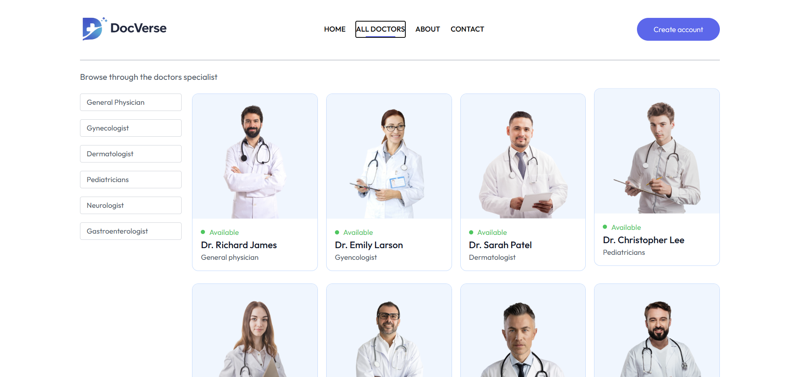
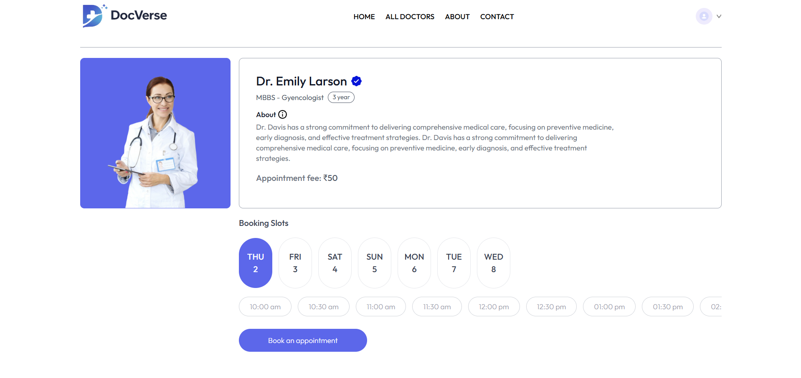
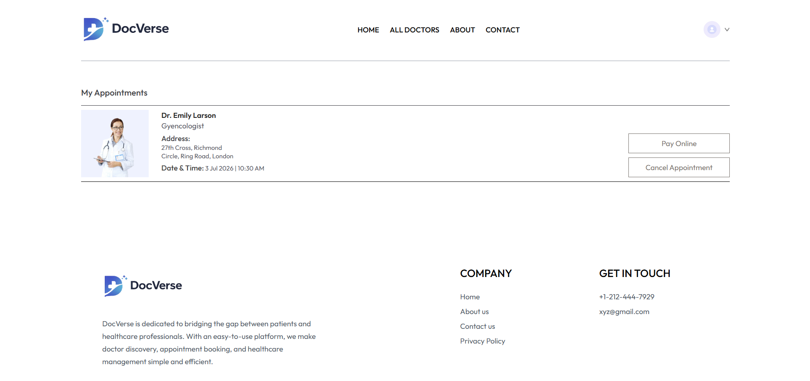
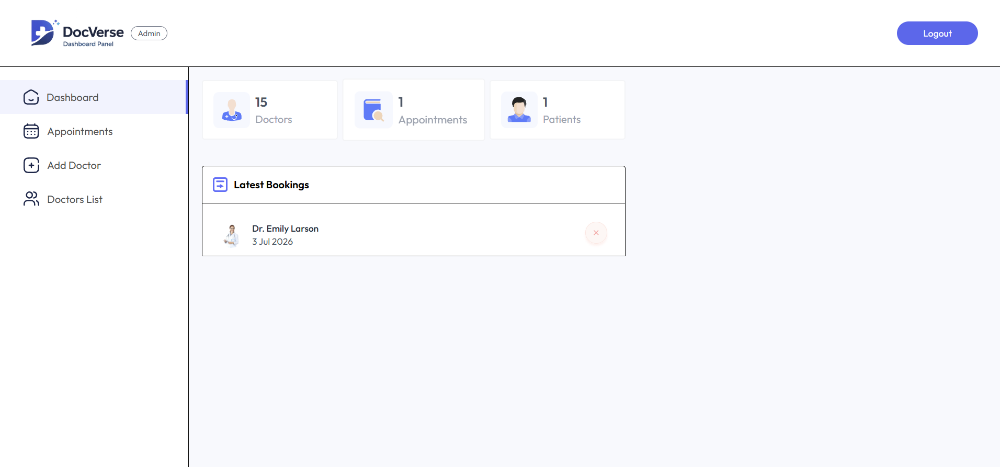
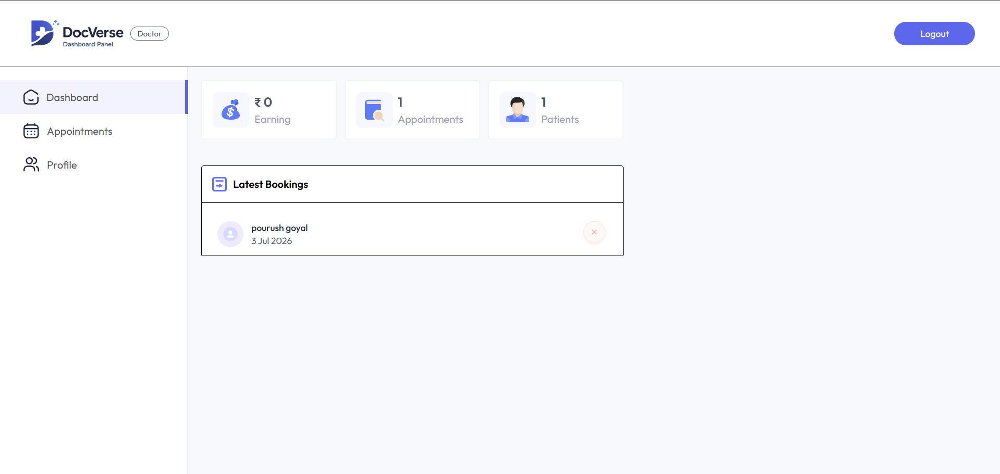

# 🩺 DocVerse

A full-stack doctor appointment booking platform built using the **MERN Stack**. DocVerse enables patients to book appointments online, doctors to manage their schedules, and administrators to oversee the entire system through dedicated dashboards.

---

## ✨ Features

### 👤 User Panel

- User Registration & Login
- Browse Doctors by Speciality
- View Doctor Profiles
- Book Appointments
- Razorpay Payment Integration
- Cancel Appointments (Before Payment / Completion)
- View Appointment Status
- Manage Profile

### 👨‍⚕️ Doctor Panel

- Secure Doctor Login
- View Assigned Appointments
- Mark Appointments as Completed
- Cancel Unpaid Appointments
- Manage Profile
- Dashboard with:
  - Total Earnings
  - Total Patients
  - Total Appointments
  - Latest Bookings

### 👨‍💼 Admin Panel

- Secure Admin Login
- Add New Doctors
- Manage Doctor Availability
- View All Appointments
- Cancel Unpaid Appointments
- Dashboard Analytics
  - Total Doctors
  - Total Patients
  - Total Appointments
  - Latest Bookings

---

## 💳 Payment

- Razorpay Payment Gateway Integration
- Secure Online Payments
- Payment Status Tracking

---

## 🔐 Authentication & Security

- JWT Authentication
- Role-Based Authorization
- Protected Routes
- Persistent Login using Local Storage
- Password Hashing using bcrypt

---

## 🛠 Tech Stack

### Frontend

- React.js
- React Router DOM
- Tailwind CSS
- Axios
- Context API
- React Toastify

### Backend

- Node.js
- Express.js
- MongoDB
- Mongoose

### Authentication

- JWT
- bcrypt

### Cloud Services

- Cloudinary
- Razorpay

---

## 📂 Project Structure

```
DocVerse
│
├── frontend
├── admin
├── backend
├── screenshots
└── README.md
```

---

## ⚙️ Installation

### Clone Repository

```bash
git clone https://github.com/beingpourush/DocVerse.git
```

### Install Dependencies

Frontend

```bash
cd frontend
npm install
```

Admin

```bash
cd admin
npm install
```

Backend

```bash
cd backend
npm install
```

---

## ▶️ Run the Project

Backend

```bash
npm run server
```

Frontend

```bash
npm run dev
```

Admin

```bash
npm run dev
```

---

## 🔑 Environment Variables

### Backend (.env)

```env
MONGODB_URI=your_mongodb_connection_string

JWT_SECRET=your_jwt_secret

CLOUDINARY_NAME=your_cloudinary_name
CLOUDINARY_API_KEY=your_cloudinary_api_key
CLOUDINARY_SECRET_KEY=your_cloudinary_secret_key

RAZORPAY_KEY_ID=your_razorpay_key_id
RAZORPAY_KEY_SECRET=your_razorpay_key_secret

ADMIN_EMAIL=your_admin_email
ADMIN_PASSWORD=your_admin_password
```

### Frontend (.env)

```env
VITE_BACKEND_URL=your_backend_url
VITE_RAZORPAY_KEY_ID=your_razorpay_key_id
```

### Admin (.env)

```env
VITE_BACKEND_URL=your_backend_url
```

---

## 👨‍💼 Admin Login

Admin credentials are configured through the **backend environment variables**.

```env
ADMIN_EMAIL=your_admin_email
ADMIN_PASSWORD=your_admin_password
```

Use these credentials to access the Admin Dashboard.

> **Note:** Doctor accounts are created through the Admin Panel. After a doctor is added, they can log in using their registered email and password.

---

## 📸 Screenshots

### 🏠 Home Page


---

### 👨‍⚕️ All Doctors



---

### 📅 Book Appointment



---

### 👤 User Appointments



---

### 👨‍💼 Admin Dashboard



---

### 👨‍⚕️ Doctor Dashboard



---

## 📚 What I Learned

- Building Full Stack MERN Applications
- REST API Development
- JWT Authentication & Authorization
- Role-Based Access Control
- MongoDB Data Modeling
- Context API State Management
- Razorpay Payment Integration
- Cloudinary Image Upload
- Dashboard Development
- Full Stack Project Structure

---

## 👨‍💻 Author

**Pourush Goyal**

GitHub: https://github.com/beingpourush

---

⭐ If you found this project useful, consider giving it a star!